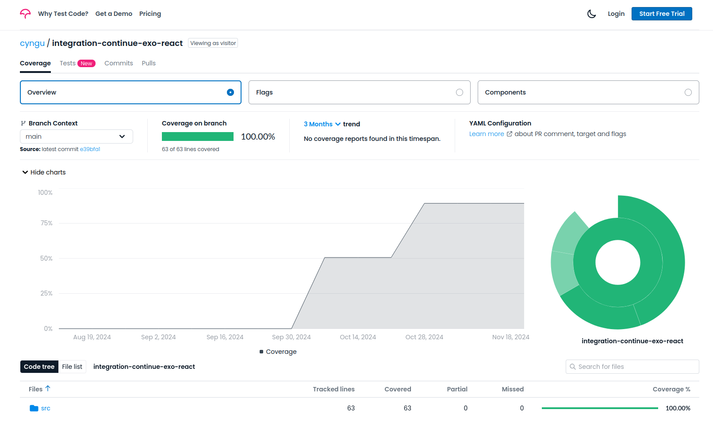

# DEPLOYMENT AND INTEGRATION

## FRONTEND

### INSTALLATION

- Clone the repository
- Execute the command `npm install` to install all needed packages
- Copy and change the values of `.env.template` in an `.env` file
- Run the application with `npm run start`

**⚠️ Warning:** With `Windows` environment, in `package.json` remove `PORT=8080` for the command `"start:dev"`.
Run `PORT=8080` then execute `npm run start:dev`

### GITHUB PAGES

The application is deployed on github pages : https://cyngu.github.io/integration-continue-exo-react/

### JSDOC

The application has a documentation for frontend component in local : http://localhost:3000/integration-continue-exo-react/docs/
To generate documentation run the command : `npm run jsdoc`

### CODE COVERAGE

To see the coverage of the source files : https://app.codecov.io/github/cyngu/integration-continue-exo-react/tree/main/src

